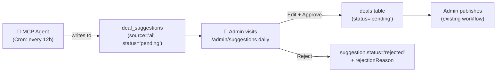

# PostHog & AI Agent Architecture

> Refined: no admin notifications, brand/category resolved from DB, MCP framework, full security hardening, improved dedup + error handling.

---

## 1. PostHog: Already Integrated ✅

Both packages are installed and wired up.

### Frontend (`apps/web`)

| File | Role |
|------|------|
| [providers.tsx](file:///c:/Users/Jojo/Desktop/Projects/uni-perks/apps/web/src/components/providers.tsx) | Inits `posthog-js`, wraps app in `<PostHogProvider>` |
| [(public)/layout.tsx](file:///c:/Users/Jojo/Desktop/Projects/uni-perks/apps/web/src/app/(public)/layout.tsx) | `PostHogTracker` captures `$pageview` on every route change |

Env vars: `NEXT_PUBLIC_POSTHOG_KEY`, `NEXT_PUBLIC_POSTHOG_HOST`

### Backend (`apps/server`)

| File | Role |
|------|------|
| [lib/posthog.ts](file:///c:/Users/Jojo/Desktop/Projects/uni-perks/apps/server/src/lib/posthog.ts) | `posthog-node` singleton + `captureEvent()` helper |
| [go.routes.ts](file:///c:/Users/Jojo/Desktop/Projects/uni-perks/apps/server/src/routes/go.routes.ts) | Fires `deal_clicked` with deal/brand/source/country/device |
| [deals.routes.ts](file:///c:/Users/Jojo/Desktop/Projects/uni-perks/apps/server/src/routes/deals.routes.ts) + [clicks.routes.ts](file:///c:/Users/Jojo/Desktop/Projects/uni-perks/apps/server/src/routes/clicks.routes.ts) | Deal CRUD + click events |

Env vars: `POSTHOG_API_KEY`, `POSTHOG_HOST`

> [!WARNING]
> Bug in `lib/posthog.ts` line 24: `client.shutdown()` is called after every event, destroying the client. Replace with `client.flush()`.

### PostHog Events to Add (Agent Pipeline)

| Event | Trigger | Key Properties |
|-------|---------|----------------|
| `agent_rss_check` | Agent polls a feed | `feed_url`, `items_found` |
| `agent_deal_discovered` | LLM classifies entry as a deal | `feed_url`, `raw_title`, `confidence` |
| `agent_deal_created` | Suggestion written to DB | `suggestion_id`, `brand_name`, `deal_title` |
| `deal_reviewed` | Admin reviews in `/admin/suggestions` | `suggestion_id`, `action`, `review_latency_ms` |
| `deal_published` | Admin promotes to `deals` table | `deal_id`, `suggestion_id` |
| `deal_rejected` | Admin rejects | `suggestion_id`, `reason` |
| `agent_run_failed` | Agent run errors out | `error_message`, `step_failed`, `run_duration_ms` |

---

## 2. Framework Choice: `@modelcontextprotocol/sdk` + Vercel AI SDK

These are **two different layers** with different roles:

| Layer | Package | Role |
|-------|---------|------|
| **MCP Server** | `@modelcontextprotocol/sdk` | Defines the tools the agent can call (RSS fetch, DB lookup, suggestion insert) |
| **Agent Runtime** | `ai` (Vercel AI SDK) | Runs Gemini via Vercel AI SDK, calls MCP tools in a loop, stops when done |

**Why not just Vercel AI SDK alone?**
Vercel AI SDK is an MCP *client* — it connects to an MCP server and drives the LLM. It doesn't build the server itself.

**Why `@modelcontextprotocol/sdk` for the server?**
It's the official TypeScript SDK, the same language as the rest of your codebase. FastMCP is Python-only.

**Why Vercel AI SDK as the runtime?**
`generateText()` with `maxSteps` runs the tool-calling loop automatically — the LLM calls a tool, gets the result, and continues thinking until it decides it's done. No manual loop needed. It supports Claude, Gemini, OpenAI via provider packages.

**Model choice:** Gemini 3.0 Flash (`gemini-3.0-flash`) is fast + cheap for RSS classification. Use Gemini 3.5 Pro (`gemini-3.5-pro`) if you need better reasoning for nuanced deal detection — latency is less critical for a 12h cron.

---

## 3. MCP Server Design (`packages/agent`)

The MCP server lives in `packages/agent` and exposes these tools:

```ts
// packages/agent/src/server.ts
import { McpServer } from "@modelcontextprotocol/sdk/server/mcp.js";
import { z } from "zod";

const server = new McpServer({ name: "uni-perks-agent", version: "1.0.0" });

// Tool 1: Fetch and parse an RSS feed
server.tool("fetch_rss_feed", { feedUrl: z.string().url() }, async ({ feedUrl }) => {
  // fetch, parse XML, return array of { title, link, pubDate, content }
});

// Tool 2: Resolve brand from DB by name
server.tool("resolve_brand", { name: z.string() }, async ({ name }) => {
  // SELECT id, name FROM brands WHERE lower(name) LIKE lower(?)
  // returns { id, name, found: boolean }
});

// Tool 3: Resolve category from DB by name
server.tool("resolve_category", { name: z.string() }, async ({ name }) => {
  // SELECT id, name FROM categories WHERE lower(name) LIKE lower(?)
});

// Tool 4: Check if a deal already exists (deduplication)
server.tool("check_duplicate", {
  claimUrl: z.string().url().optional(),
  titleHash: z.string().optional(), // SHA-256 of lowercase(title + brandName) for fallback dedup
}, async ({ claimUrl, titleHash }) => {
  // Primary: checks claimUrl in deals + deal_suggestions tables
  // Fallback: if no claimUrl, uses titleHash to catch deals with changed URLs
  // returns { isDuplicate: boolean, matchType: 'url' | 'title_hash' | null }
});

// Tool 5: Create a deal suggestion (the only write operation)
server.tool("create_suggestion", {
  brandName: z.string(),
  dealTitle: z.string().max(200),
  description: z.string().max(1000),
  discountLabel: z.string().max(100),
  claimUrl: z.string().url(),
  category: z.string(),
  resolvedBrandId: z.string().optional(),
  resolvedCategoryId: z.string().optional(),
  confidenceScore: z.number().min(0).max(1),
  sourceUrl: z.string().url(),
  rawEntryJson: z.string(), // JSON.stringify of original RSS entry
}, async (args) => {
  // Validates, sanitizes, then inserts into deal_suggestions
  // source='ai', status='pending', submittedBy='rss-agent-v1'
});
```

**Transport:** The MCP server runs as a `StdioServerTransport` (subprocess) or `SSEServerTransport` (HTTP/SSE for Cloudflare). For a cron job, stdio is simplest. If you add webhook/on-demand triggers later, switch to SSE — the MCP server design stays the same, only the transport changes.

---

## 4. Agent Runtime (Vercel AI SDK)

The agent orchestrator runs on a schedule (Cloudflare Cron or Node cron). It connects to the MCP server as a client and drives Claude/Gemini through the tool loop:

```ts
// packages/agent/src/run.ts
import { generateText } from "ai";
import { google } from "@ai-sdk/google";
import { createMCPClient } from "@ai-sdk/mcp";

async function runAgent() {
  const startTime = Date.now();
  const mcp = await createMCPClient({ transport: /* connect to MCP server */ });
  const tools = await mcp.tools(); // auto-discovers all server.tool() definitions

  try {
    const { text } = await generateText({
      model: google("gemini-3.0-flash"),
      tools,
      maxSteps: 20, // LLM calls tools in a loop until done
      system: `
      You are a deal-discovery agent for uni-perks.com, a student discount platform.
      Your job: check RSS feeds, identify genuine student/university deals, and create suggestions.
      Rules:
      - Only create suggestions for deals explicitly targeting students or universities
      - Always resolve the brand and category from the database before creating a suggestion
      - Always check for duplicates before creating a suggestion
      - Set confidenceScore based on how certain you are this is a student deal (0-1)
      - Never create more than 10 suggestions per run
      - If a tool call fails, retry once with exponential backoff (1s, 2s)
      - If a tool fails twice, skip that feed and log the error
    `,
    prompt: "Check all configured RSS feeds and create suggestions for any new student deals you find.",
  });
  } catch (error) {
    await captureEvent({
      event: "agent_run_failed",
      properties: {
        error_message: error.message,
        run_duration_ms: Date.now() - startTime,
      },
    });
    throw error;
  }

  await mcp.close();
}
```

The LLM will autonomously:

1. Call `fetch_rss_feed` for each configured feed
2. Evaluate each entry — is it a student deal?
3. Call `check_duplicate` before proceeding
4. Call `resolve_brand` and `resolve_category` against your real DB
5. Call `create_suggestion` with all resolved IDs

---

## 5. Human Review Workflow

Admin checks `/admin/suggestions` at a fixed time each day — **no notifications**.



| Action | What happens |
|--------|-------------|
| **Load page** | Lists all `pending` AI suggestions, newest first |
| **Edit** | Admin corrects brand, category, title, discount |
| **Approve** | Copies to `deals` table with resolved IDs, marks suggestion `approved` |
| **Reject** | Marks `rejected`, stores `rejectionReason` |

> [!IMPORTANT]
> The agent **never writes to the `deals` table**. Only `dealSuggestions`. The admin is the gate.

---

## 6. Schema Extension Needed

The current `dealSuggestions` table needs 5 new columns to support the agent workflow:

```ts
// packages/db/src/schema/dealSuggestions.ts  — add these:
resolvedBrandId: text('resolved_brand_id'),        // FK to brands.id (nullable)
resolvedCategoryId: text('resolved_category_id'),  // FK to categories.id (nullable)
confidenceScore: real('confidence_score'),          // LLM confidence 0–1
sourceUrl: text('source_url'),                      // Which RSS feed
rawEntryJson: text('raw_entry_json'),               // Original entry for audit
reviewerNotes: text('reviewer_notes'),             // Admin feedback for model improvement (nullable)
```

---

## 7. Security

| Concern | Mitigation |
|---------|-----------|
| Agent writes unvetted data | Agent only writes to `dealSuggestions`. Humans promote to `deals`. |
| RSS SSRF / malicious feeds | Feed URLs hardcoded in agent config — never from DB or user input. HTTPS only, 5s timeout, 1MB max. |
| LLM hallucinations in DB | All LLM output goes through Zod before any DB write. Max lengths enforced. |
| `claimUrl` injection | URL must be valid + match the source feed's domain |
| Runaway agent (flood) | Max 10 suggestions per run enforced in system prompt and code-level counter |
| External trigger abuse | `AGENT_SECRET` header required on any HTTP trigger endpoint |
| Audit | `sourceUrl` + `rawEntryJson` on every suggestion row. `submittedBy = 'rss-agent-v1'`. |
| Tool failures / API errors | Retry once with exponential backoff (1s, 2s). Skip feed on second failure. Log `agent_run_failed` to PostHog. |

---

## 8. Package Structure

```
packages/agent/
  src/
    server.ts        ← MCP server (tools: fetch, resolve, dedupe, insert)
    run.ts           ← Agent runner (Vercel AI SDK + MCP client)
    feeds.ts         ← Hardcoded RSS feed allowlist
    parser.ts        ← RSS/Atom XML parser
    sanitize.ts      ← LLM output sanitization + Zod schemas
  package.json       ← @modelcontextprotocol/sdk, ai, @ai-sdk/google
```

---

## 9. Summary: What's Done vs. Needed

| Area | Status | Notes |
|------|--------|-------|
| PostHog frontend | ✅ Done | pageview tracking working |
| PostHog backend | ✅ Done | `captureEvent()` helper used in routes |
| `posthog.ts` `shutdown()` bug | ⚠️ Bug | Replace with `flush()` |
| `dealSuggestions` schema | ⚠️ Partial | Needs 6 new columns (see §6) |
| MCP server (`packages/agent`) | ❌ Not built | 5 tools to implement |
| Agent runtime (Vercel AI SDK) | ❌ Not built | `generateText` + MCP client + error handling |
| Cloudflare Cron scheduling | ❌ Not built | `scheduled()` handler |
| Admin suggestions UI | ❌ Not built | `/admin/suggestions` page |
| Agent PostHog events | ❌ Not built | 7 new events (see §1) |
| Security guardrails | ❌ Not built | URL allowlist, Zod validation, rate limiting, retry logic |
